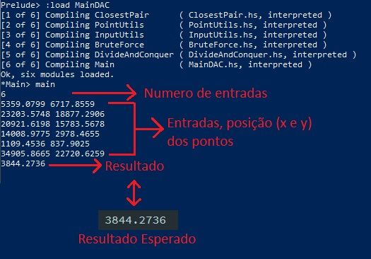
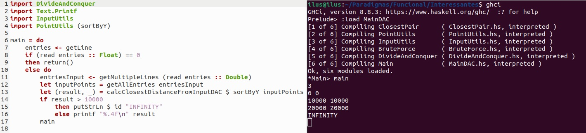
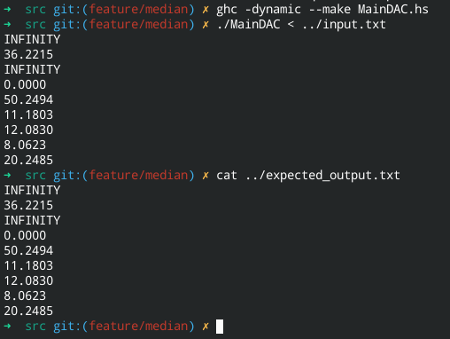
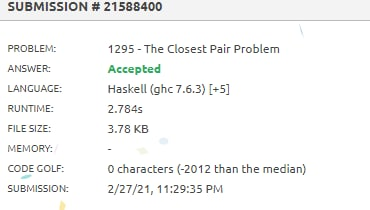

# The closest Pair Problem

**Disciplina**: FGA0210 - PARADIGMAS DE PROGRAMAÇÃO - T01  
**Nro do Grupo**: 01 
**Paradigma**: Funcional 

## Alunos
|Matrícula | Aluno |
| -- | -- |
| 15/0009011  |  Elias Bernardo |
| 19/0106565  |  Fernando Miranda Calil |
| 15/0008228  |  Daniel Marques Rangel |
| 16/0132550  |  Lorrany dos Santos Azevedo |

## Sobre 
Nosso grupo propos a implementação do código que resolve o problema clássico de pares mais próximos, com foco em resolver o [problema no URI](https://www.urionlinejudge.com.br/judge/pt/problems/view/1295) utilizando a linguagem haskell.

Tivemos como referência os códigos presentes nesse repositório na pasta __solucao_imperativa__, nas linguagens python e C, ambos fornecidos pelo integrante Elias, que já havia resolvido o problema antes na disciplina de Projeto de Algoritmos. Implementamos a solução de duas formas diferentes, utilizando a força bruta, que possui complexidade __O(n^2)__ e a estratégia de dividir para conquistar, complexidade __O(n log n)__.

A fim de compararmos a programação declarativa (funcional), com a programação imperativa também implementamos soluções brute force e _divide and conquer_ em Python e em c.

## Screenshots

Funcionamento no terminal:

Execução do binário com o input fornecido (e comparação com o output esperado):

Envio da solução no URI:

## Instalação 
**Linguagens**: Haskell, _Python, c_ (opcionais) 

**Pré-requisitos**:
* Linguagem Haskell
* Compilador GHC

Primeiramente tenha a certeza de ter o Haskell e o compilador GCH instalado. Caso não esteja, siga [esse link](https://www.haskell.org/platform/) para realizar a instalação.

Após a instalação, clone o repositório e entre na pasta "src":

    $ git clone https://github.com/UnBParadigmas2020-2/2020.2_G1_Funcional_ClosestPairProblem.git

    $ cd 2020.2_G1_Funcional_ClosestPairProblem/src/

E compile o projeto:

    $ ghc -dynamic --make MainDAC.hs

> O arquivo pode ser o MainBruteForce caso prefira compilar a versão de força bruta.

    $ ghc -dynamic --make MainBruteForce.hs

Ao final serão gerados diversos arquivos, sendo o principal deles __MainDAC__ (ou MainBruteForce caso o tenha compilado)

## Uso 

Para usar o projeto, primeiro compile-o de acordo com as instruções acima. Depois, num terminal, execute o comando

    $ ./MainDAC < ../input.txt

Esse comando irá executar o projeto, passando o input especificado no arquivo __input.txt__. A saída esperada (no terminal) deve bater com o que está no arquivo __expected_output.txt__.

Caso prefira inserir a entrada manualmente, você pode executar apenas `./MainDAC` num terminal e inserir dados de acordo com o especificado no [problema do URI](https://www.urionlinejudge.com.br/judge/pt/problems/view/1295).

## Vídeo
O vídeo de apresentação do projeto se encontra na pasta __assets/Projeto1.mp4__

## Outros 

A fim de compararmos a programação declarativa (funcional), com a programação imperativa também implementamos soluções brute force e _divide and conquer_ em Python e em c.

As principais diferença notadas entre as programações citadas, é a falta de estruturas de repetição na programação declarativa, o uso constante de funções, listas e recursões, lazy evalution e dados imutáveis, sendo que na programação imperativa nós descrevemos o comportamento de um dado algoritimo, temos estruturas de repetição, strict evalution, uso de váriaveis entre outros. As implementações imperativas também se encontram disponíves no nosso repositório na pasta solucao_imperativa.

## Fontes
- [https://github.com/projeto-de-algoritmos/D-C_Closest_pair_problem](https://github.com/projeto-de-algoritmos/D-C_Closest_pair_problem)
- [https://hoogle.haskell.org](https://hoogle.haskell.org/)
